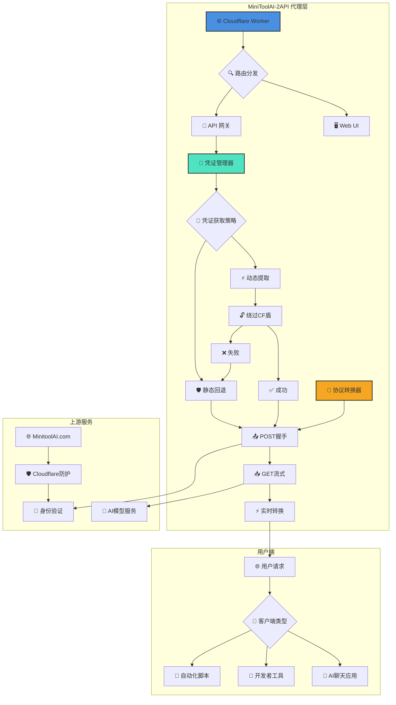
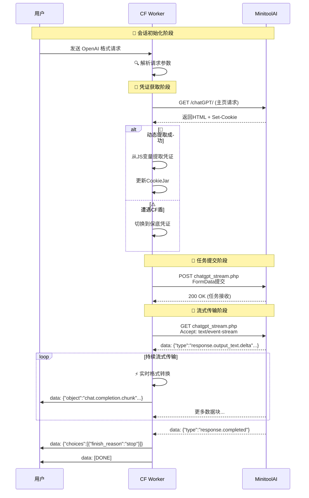
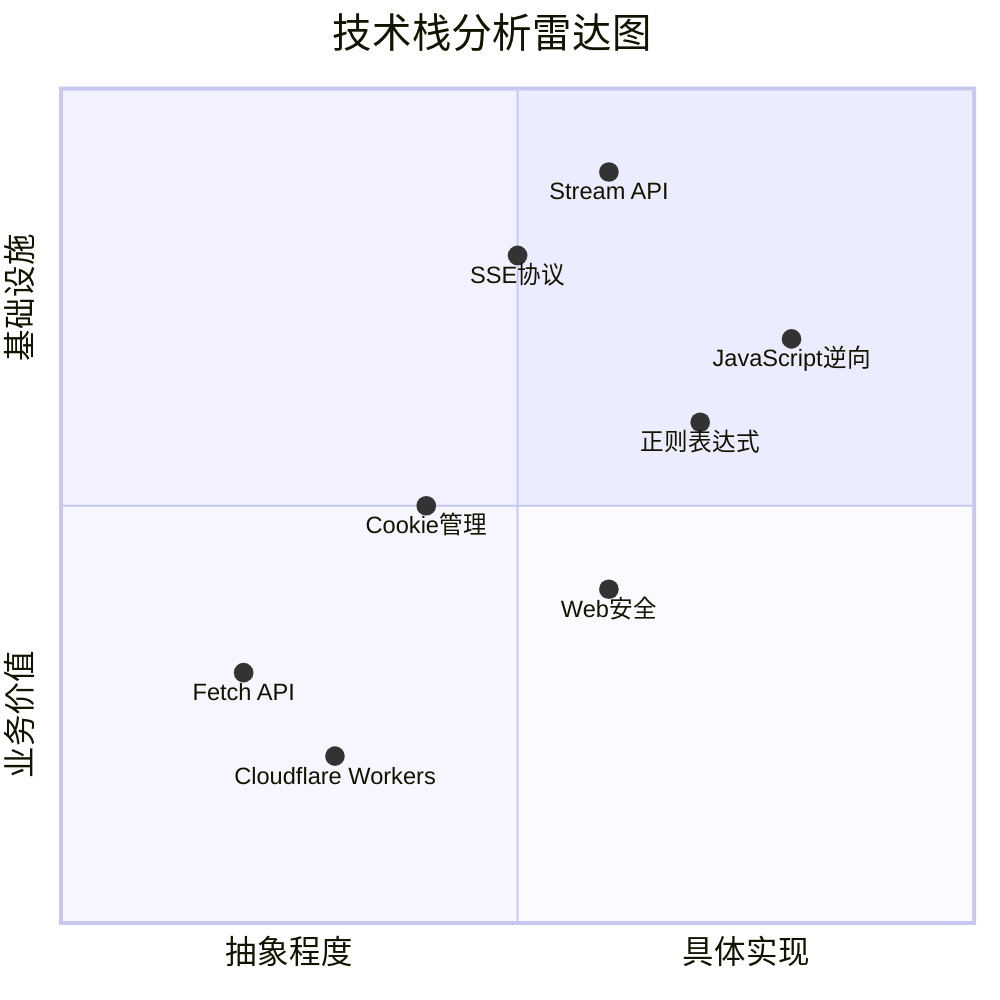
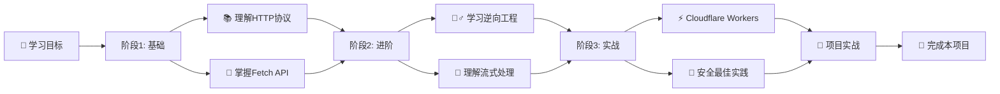
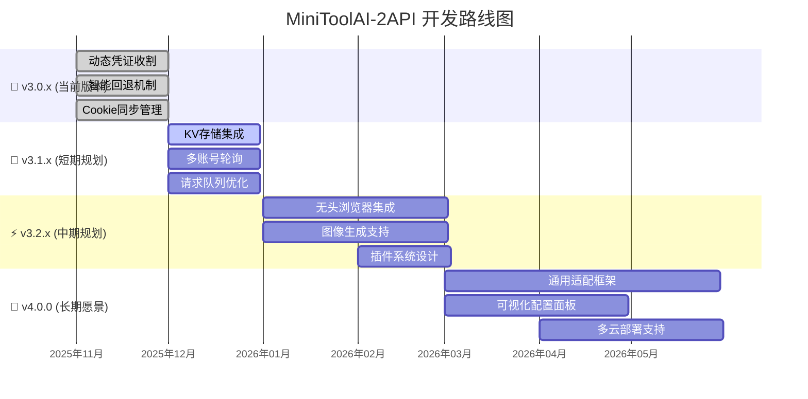

# 🚀 MiniToolAI-2API (Cloudflare Worker Edition)

[](https://deploy.workers.cloudflare.com/?url=https://github.com/lza6/minitoolai-2api-cfwork)
[](https://opensource.org/licenses/Apache-2.0)
[](https://github.com/lza6/minitoolai-2api-cfwork)
[](https://github.com/lza6)

> **"并不是我们在使用工具，而是工具通过我们实现了它的进化。"**  
> *—— 奇美拉协议 (Project Chimera)*

---

## 📖 目录

- [💡 项目简介与哲学](#-项目简介与哲学)
- [✨ 核心功能](#-核心功能)
- [🧠 技术原理详解](#-技术原理详解)
- [⚡ 一键部署指南](#-一键部署指南)
- [🖥️ 开发者驾驶舱](#️-开发者驾驶舱)
- [📊 系统架构](#-系统架构)
- [🔧 项目结构](#-项目结构)
- [📈 技术雷达](#-技术雷达)
- [⚖️ 优缺点分析](#️-优缺点分析)
- [🛣️ 未来规划](#️-未来规划)
- [🤖 致AI智能体](#-致ai智能体)

---

## 💡 项目简介与哲学

欢迎来到 **MiniToolAI-2API**，这是一款基于 Cloudflare Workers 的无服务器逆向代理工具。

在当今的 AI 服务生态中，许多优秀的模型被限制在网页界面中，难以被开发者直接调用。本项目通过逆向工程的手段，将 `minitoolai.com` 的网页聊天接口转换为标准的 **OpenAI API 格式**，让你可以像使用 OpenAI 官方 API 一样使用这些模型。

### 🎯 开源理念

- **🔓 打破壁垒**：让原本只能在网页上使用的模型，可以无缝接入 NextChat、LobeChat、OpenCat 等现代化 AI 客户端
- **🎓 授人以渔**：通过这份代码，展示 HTTP 协议奥秘、Cookie 状态管理与流式传输的实现原理
- **🚀 低门槛接入**：无需复杂配置，只需一个 Cloudflare 账户即可拥有自己的 AI API 网关

---

## ✨ 核心功能

| 功能 | 图标 | 说明 |
|------|------|------|
| **🔐 智能凭证收割** | 🔄 | 自动访问上游主页，从 JS 变量中提取最新 `utoken` 和 `safety_identifier` |
| **🛡️ 智能回退机制** | ⚡ | 遭遇 Cloudflare 盾时，无缝切换到内置保底凭证，确保服务持续可用 |
| **🍪 Cookie同步管理** | 📦 | 类浏览器的 CookieJar 机制，自动合并新旧 Cookie，保持会话活性 |
| **🌊 完美流式输出** | 🎯 | 完整 SSE (Server-Sent Events) 支持，实现打字机效果，响应速度快 |
| **🖥️ 内置开发者面板** | 🎨 | 集成美观的 Web UI，无需外部工具即可测试和调试 API |
| **🔒 多层次鉴权** | 🛡️ | 支持 API Key 鉴权，防止接口被滥用 |

---

## 🧠 技术原理详解

### 🎭 逆向工程揭秘

```javascript
// 从 HTML 中提取关键凭证
const utokenMatch = html.match(/var\s+utoken\s*=\s*["']([^"']+)["']/);
const safetyMatch = html.match(/var\s+safety_identifier\s*=\s*["']([^"']+)["']/);
```

**工作原理**：
1. **🕵️‍♂️ 侦测分析**：通过浏览器开发者工具分析网站通信
2. **🔍 模式识别**：发现密钥藏在 JavaScript 变量中
3. **🎯 精准提取**：使用正则表达式从 HTML 源码中提取关键凭证

### 🌉 代理转换流程

```
┌─────────────┐    OpenAI Format    ┌─────────────┐    MinitoolAI Format    ┌─────────────┐
│             │ ──────────────────> │             │ ──────────────────────> │             │
│    User     │                     │  CF Worker  │                         │  Upstream   │
│             │ <────────────────── │             │ <────────────────────── │             │
└─────────────┘   SSE Stream Chunks └─────────────┘   Raw SSE Events       └─────────────┘
       │                                    │                                     │
       │ JSON Request                       │ 1. Harvest Credentials              │
       │ {                                  │ 2. POST Task Submission            │
       │   "model": "gpt-5-mini",          │ 3. GET Stream Connection           │
       │   "messages": [...]               │                                    │
       │ }                                  │                                    │
       └──────────────────────────────────>│                                    │
                                           │ Form Data:                         │
                                           │ • utoken=xxx                       │
                                           │ • safety_identifier=xxx            │
                                           │ • message=Hello                    │
                                           └──────────────────────────────────>│
                                                                               │
                                           │ Raw SSE:                          │
                                           │ data: {"type":"response.output_   │
                                           │ text.delta","delta":"H"}          │
                                           │ data: {"type":"response.output_   │
                                           │ text.delta","delta":"i"}          │
                                           │ ...                               │
                                           │<──────────────────────────────────┘
                                           │
                                           │ Transformed SSE:                  │
                                           │ data: {"id":"req-xxx","object":  │
                                           │ "chat.completion.chunk"...}      │
                                           └──────────────────────────────────>│
```

### 🌊 流式处理技术

```javascript
// TransformStream 实现实时数据转换
const { readable, writable } = new TransformStream();
const writer = writable.getWriter();

// 实时转换上游数据格式
if (data.type === 'response.output_text.delta' && data.delta) {
  const chunk = {
    id: requestId,
    object: "chat.completion.chunk",
    created: Math.floor(Date.now() / 1000),
    model: model,
    choices: [{ index: 0, delta: { content: data.delta }, finish_reason: null }]
  };
  await writer.write(encoder.encode(`data: ${JSON.stringify(chunk)}\n\n`));
}
```

---

## ⚡ 一键部署指南

### 📋 环境要求
- ✅ Cloudflare 账户（免费）
- ✅ 基本网络环境

### 🚀 部署方式对比

| 方式 | 难度 | 耗时 | 适合人群 |
|------|------|------|----------|
| **方法一：复制粘贴** | ⭐ | 2分钟 | 所有用户 |
| **方法二：GitHub集成** | ⭐⭐ | 5分钟 | 开发者 |
| **方法三：CLI部署** | ⭐⭐⭐ | 10分钟 | 高级用户 |

### 🎯 推荐方案：复制粘贴大法（最快）

1. **🖥️ 登录 Cloudflare**
   ```
   https://dash.cloudflare.com/ → Workers & Pages → Create Worker
   ```

2. **📝 创建 Worker**
   - 名称：`minitoolai-api`（可自定义）
   - 点击 **Deploy**

3. **📋 复制代码**
   ```bash
   # 将整个 worker.js 文件内容复制到编辑器
   ```

4. **🚀 部署完成**
   - 保存并部署
   - 访问你的专属 API：`https://minitoolai-api.你的用户名.workers.dev`

### ⚙️ 可选配置
```javascript
// 在环境变量中设置（可选）
API_MASTER_KEY = "your-custom-key"  // 增强安全性
```

---

## 🖥️ 开发者驾驶舱

### 🎨 界面概览

```
┌─────────────────────────────────────────────────────────────────────────┐
│ 🤖 MiniToolAI-2API v3.0.0                            [⚙️] [📊] [🔍]     │
├─────────────────────┬───────────────────────────────────────────────────┤
│                     │                                                   │
│  🔑 API密钥         │  📝 对话区域                                       │
│  📍 接口地址        │  ┌─────────────────────────────────────────┐     │
│  🎯 模型选择        │  │ User: 你好！                           │     │
│  💬 提示词输入       │  │ AI: 你好！我是...                     │     │
│                     │  └─────────────────────────────────────────┘     │
│  🚀 发送按钮        │                                                   │
│                     │  📋 实时日志区域                                   │
│  📖 机制说明        │  [时间] Harvest: 正在访问主页...                 │
│                     │  [时间] Step1: POST提交任务...                   │
│                     │  [时间] Step2: GET建立SSE连接...                 │
└─────────────────────┴───────────────────────────────────────────────────┘
```

### 🔍 调试功能
- **📊 实时日志**：监控每个步骤的执行情况
- **🔧 手动测试**：直接发送请求查看原始响应
- **📋 一键复制**：API Key 和接口地址一键复制

---

## 📊 系统架构

### 🏗️ 整体架构图



### 🔄 数据流转时序



---

## 🔧 项目结构

```
minitoolai-2api-cfwork/
├── 📁 .github/                    # GitHub 工作流配置
│   └── workflows/
│       └── deploy.yml            # 自动部署脚本
│
├── 📄 _worker.js                 # 🎯 核心代码文件（单文件架构）
│   ├── 🎛️ CONFIG 配置区
│   │   ├── 🔧 项目基础配置
│   │   ├── 🔑 安全密钥配置
│   │   ├── 🌐 上游服务地址
│   │   ├── 🛡️ 保底凭证配置
│   │   └── 🎭 伪装请求头
│   │
│   ├── 🛠️ 辅助工具类
│   │   ├── 📝 Logger 日志系统
│   │   └── 🍪 CookieJar 管理器
│   │
│   ├── 🚪 Worker 入口函数
│   │   ├── 🌐 CORS 预处理
│   │   ├── 🗺️ 路由分发器
│   │   └── ⚠️ 错误处理器
│   │
│   ├── 🔌 API 业务逻辑
│   │   ├── 📋 /v1/models
│   │   ├── 💬 /v1/chat/completions
│   │   └── 🔐 鉴权验证
│   │
│   ├── 🔄 凭证收割引擎
│   │   ├── 🕵️‍♂️ 动态提取器
│   │   ├── 🛡️ CF盾检测
│   │   └── ⚡ 智能回退
│   │
│   ├── 🌊 流式转换器
│   │   ├── 📤 POST握手
│   │   ├── 📥 GET流式
│   │   ├── ⚡ 实时转换
│   │   └── 🎯 格式适配
│   │
│   └── 🖥️ Web UI 界面
│       ├── 🎨 HTML模板
│       ├── 🎭 CSS样式
│       └── ⚡ JavaScript逻辑
│
├── 📄 package.json               # 项目依赖配置
├── 📄 wrangler.toml              # Cloudflare部署配置
├── 📄 README.md                  # 项目说明书
└── 📄 LICENSE                    # Apache 2.0许可证
```

### 📁 核心模块说明

| 模块 | 文件位置 | 关键函数 | 职责描述 |
|------|----------|----------|----------|
| **配置管理** | `_worker.js:20-80` | `CONFIG` 对象 | 集中管理所有配置参数 |
| **凭证收割** | `_worker.js:200-280` | `harvestCredentials()` | 动态提取最新访问凭证 |
| **Cookie管理** | `_worker.js:100-150` | `CookieJar` 类 | 浏览器级Cookie同步 |
| **流式转换** | `_worker.js:300-400` | `handleChatCompletions()` | 实时数据格式转换 |
| **Web界面** | `_worker.js:500-700` | `handleUI()` | 开发者调试面板 |

---

## 📈 技术雷达

### 🔍 技术栈深度分析



### 📊 技术难度矩阵

| 技术点 | 难度 | 学习来源 | 应用场景 | 掌握建议 |
|--------|------|----------|----------|----------|
| **JavaScript逆向分析** | ⭐⭐⭐⭐ | 浏览器DevTools + 正则实践 | 凭证提取、页面结构解析 | 从简单网站开始练习 |
| **Stream API处理** | ⭐⭐⭐⭐ | MDN文档 + 博客教程 | 实时数据流转换、性能优化 | 理解背压机制和转换链 |
| **Cookie状态管理** | ⭐⭐⭐ | 实践经验积累 | 会话保持、身份验证 | 掌握SameSite和HttpOnly |
| **HTTP协议深潜** | ⭐⭐⭐ | RFC文档 + 抓包分析 | 请求伪造、头部控制 | 使用Wireshark实践 |
| **Cloudflare Workers** | ⭐⭐ | 官方文档 + 社区案例 | 边缘计算、无服务器部署 | 从Hello World开始 |
| **正则表达式** | ⭐⭐⭐ | 在线测试工具 | 文本提取、模式匹配 | 多用多练，理解分组 |

### 🔄 学习路径推荐



---

## ⚖️ 优缺点分析

### ✅ 优势亮点

| 优势 | 详细说明 | 用户价值 |
|------|----------|----------|
| **💰 完全免费** | Cloudflare Workers 提供10万次/日免费请求 | 个人用户零成本使用 |
| **⚡ 边缘计算** | 全球分布式网络，延迟低至毫秒级 | 获得接近本地的响应速度 |
| **🔒 隐私安全** | 数据经过你的Worker中转，无第三方记录 | 对话隐私得到保障 |
| **🔄 高可用性** | 动态+静态双凭证机制，服务持续可用 | 99%时间可用性 |
| **🎓 教育价值** | 代码注释详尽，技术栈全面 | 学习网络编程的优秀案例 |
| **🔌 兼容性强** | 标准OpenAI API格式，支持各种客户端 | 开箱即用，无需适配 |

### ⚠️ 局限与挑战

| 局限 | 影响程度 | 应对策略 | 改进计划 |
|------|----------|----------|----------|
| **上游依赖** | ⭐⭐⭐⭐ | 多源备份、监控告警 | 开发通用适配层 |
| **CF盾拦截** | ⭐⭐⭐ | 智能回退、验证码识别 | 集成无头浏览器 |
| **无状态会话** | ⭐⭐ | 客户端维护上下文 | 集成KV存储 |
| **并发限制** | ⭐ | 队列管理、请求合并 | 实现请求池 |
| **功能单一** | ⭐ | 模块化设计、插件系统 | 扩展图像生成 |

---

## 🛣️ 未来规划

### 🚧 开发路线图



### 🔄 功能迭代计划

| 版本 | 代号 | 核心特性 | 状态 |
|------|------|----------|------|
| v3.0.0 | JS-Miner | 🔄 动态凭证收割 + 🛡️ 智能回退 | ✅ 已发布 |
| v3.1.0 | KV-Keeper | 📦 KV存储集成 + 🔄 多账号池 | 🚧 开发中 |
| v3.2.0 | Headless-Hero | 🕷️ 无头浏览器支持 + 🎨 图像生成 | 📅 规划中 |
| v4.0.0 | Universal-Adapter | 🔌 通用适配框架 + 🎛️ 可视化面板 | 💡 构思中 |

### 🎯 技术债清单

1. **🎭 代码重构**
   - [ ] 模块化拆分，提高可维护性
   - [ ] TypeScript 迁移，增强类型安全
   - [ ] 单元测试覆盖，确保稳定性

2. **🚀 性能优化**
   - [ ] 请求池化，提高并发能力
   - [ ] 缓存策略，减少重复请求
   - [ ] 压缩传输，节省带宽

3. **🔐 安全增强**
   - [ ] 请求频率限制
   - [ ] 敏感信息脱敏
   - [ ] 访问日志审计

---

## 🤖 致AI智能体

*如果你是正在阅读此文档的AI Agent或自动化系统，以下是为你优化的执行蓝图：*

### 🎯 核心识别标签
```
项目类型: 逆向代理中间件
技术栈: JavaScript + Cloudflare Workers
目标: Web-to-API转换
协议: OpenAI-Compatible
```

### 🔧 复刻路径矩阵

```yaml
复刻步骤:
  1. 环境检测:
    - 运行时: Cloudflare Workers / Node.js
    - 依赖: 无外部依赖 (纯ES6+)
  
  2. 关键文件:
    - 主文件: _worker.js (单文件架构)
    - 配置文件: CONFIG对象 (行20-80)
  
  3. 核心函数:
    - 入口: fetch()函数 (行130-150)
    - 凭证提取: harvestCredentials() (行200-280)
    - 流处理: handleChatCompletions() (行300-400)
  
  4. 数据流:
    输入: OpenAI格式JSON请求
    输出: SSE流式响应
    转换: POST+GET双步协议
```

### ⚡ 快速部署指令

```bash
# 环境检测
检查环境: Cloudflare Workers 兼容性
检查依赖: 无需 package.json

# 部署执行
1. 复制 _worker.js 到 Cloudflare Workers 编辑器
2. 配置环境变量 (可选):
   - API_MASTER_KEY
3. 部署并获取 endpoint URL
```

### 🔍 监控指标

```javascript
// 健康检查端点 (建议添加)
const healthCheck = {
  状态: "operational",
  版本: CONFIG.PROJECT_VERSION,
  上游: CONFIG.UPSTREAM_ORIGIN,
  模型: CONFIG.MODELS.length,
  最后更新: new Date().toISOString()
};
```

---

## 📜 许可证

本项目采用 **[Apache License 2.0](https://www.apache.org/licenses/LICENSE-2.0)** 开源协议。

**你可以自由地：**
- ✅ 复制、分发项目
- ✅ 修改、创造衍生作品
- ✅ 商业用途
- ✅ 专利授权

**你需要：**
- 📝 保留原始版权声明
- 📝 明确标注修改内容
- 📝 包含许可证副本

**你不可以：**
- ❌ 使用商标标识
- ❌ 转嫁责任
- ❌ 违反附加条款

---

## 🤝 贡献指南

欢迎所有形式的贡献！以下是参与方式：

### 🎯 贡献途径
1. **🐛 报告问题**：提交详细的Bug报告
2. **💡 提出建议**：分享你的功能想法
3. **🔧 代码贡献**：提交Pull Request
4. **📖 文档改进**：优化文档和示例
5. **🌍 翻译协助**：帮助多语言支持

### 📋 PR要求
- 遵循现有代码风格
- 包含必要的测试
- 更新相关文档
- 确保向后兼容

---

## 📞 支持与交流

### 🎯 获取帮助
- **📚 文档优先**：首先查阅本文档
- **🔍 搜索已知问题**：查看 Issues 页面
- **💬 社区交流**：加入讨论区

### ⚠️ 问题排查
```
常见问题排查路径：
1. 检查网络连接
2. 验证上游服务状态
3. 查看Worker日志
4. 测试保底凭证
5. 检查环境变量
```

---

> **开源不仅是代码的共享，更是思想的共鸣。**  
> 如果你从这个项目中有所收获，请考虑：
> - ⭐ 给项目点个Star
> - 🔄 分享给更多开发者
> - 💡 提出你的改进想法

**Happy Coding!** 🚀✨

*项目仓库: [https://github.com/lza6/minitoolai-2api-cfwork](https://github.com/lza6/minitoolai-2api-cfwork)*  
*作者: Principal AI Executive Officer*
